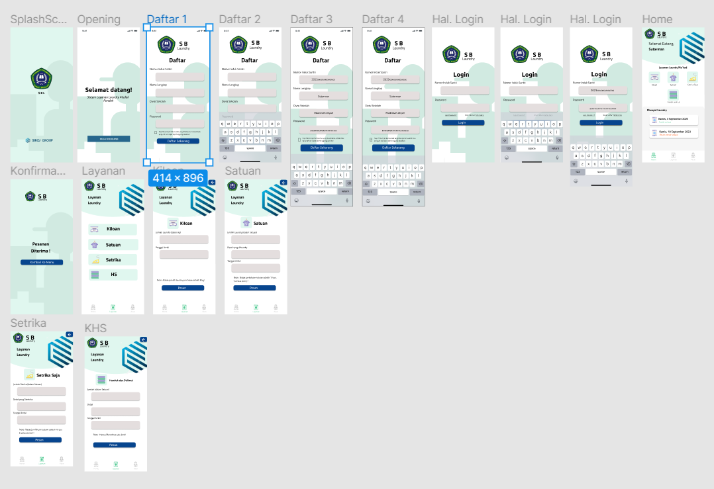
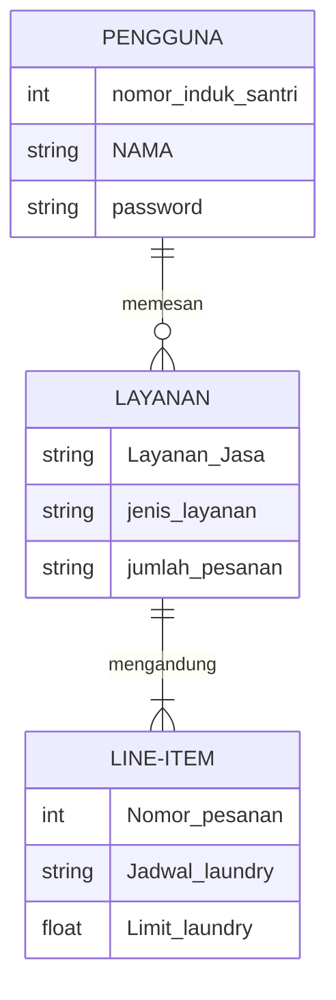
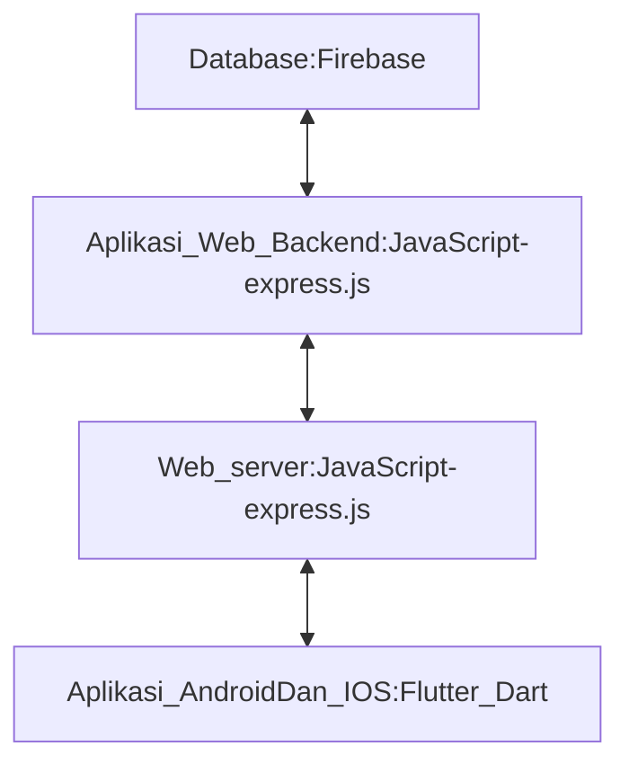

## MEMBUAT APLIKASI SISTEM MANAJEMEN PESANTREN  
## 1.1 Latar Belakang
Kemajuan Teknologi Informasi kian tak terbendung, Pondok pesantren sebagai sebuah lembaga pendidikan turut terasa imbasnya, Salah satunya Yayasan Pondok Pesantren Pembangunan "Sumur Bandung" Cililin. Digitalisasi informasi menjadi hal yang sulit dihindari. Maka dari itu, mesti ada layanan terpadu Pondok yang terintegrasi dan menjadi layanan informatif bagi santri, wali santri, dan seluruh warga pesantren serta masyarakat pada umumnya.  
  
  ## 1.2 Deskripsi Teknologi Informasi
Aplikasi ini bergerak di dalam sistem informasi serta layanan Pondok Pesantren. Aplikasi ini dapat :  
1. Mendapatkan Informasi mengenai layanan Pondok.  
2. Layanan Pembayaran Infaq Bulanan (Syahriah) bagi santri  
3. Layanan Jasa Laundry Pondok.   
4. Mendapatkan Informasi mengenai perkembangan akademik santri.   
5. Menampilkan amalan ibadah amaliyah pondok.   
6. Menjadi Sistem integrasi digitalisasi pemberkasan, dan kegiatan administrasi kantor Pondok Pesantren

  ## 1.3 Branding 
 Adapun Brand yang dirancang dalam sistem Layana Pondok Pesantren ini adalah :   

Merk: SBQu  
Tagline: _Sumur Bandung Ummuna!_ 
Campaign: Bagaimana membuat aplikasi yang mempermudah sistem layanan  di " Pondok Pesantren Pembangunan Sumur Bandung " 
Target user: 
- Santri aktif "Pondok Pesantren Pembangunan Sumur Bandung". 
- Wali Santri "Pondok Pesantren Pembangunan Sumur Bandung".  
- Guru, Staf, dan seluruh warga "Pondok Pesantren Pembangunan Sumur Bandung". 
- Muslim, Masyarakat seluruh kalangan umur.  
User experience theme: 
Sederhana,
Mudah 
Warna: Dominan Hijau, Sesuai dengan warna dominan Pondok  
Inspirasi Design :  

  ## 2. User Story
  Sebagai | Saya Ingin | Supaya Dapat | Prioritas
---|---|---|---
Pengguna | Memesan Pesanan | Mendapatkan jasa layanan yang diingikan dalam memesan pesanan | ⭐⭐⭐⭐⭐
| | |
Pengguna | Mendapat notifikasi pengingat | Dapat teringat jadwal Laundry User | ⭐⭐⭐⭐
| | |
Pengguna | Memesan sesuai kategori | Memesan Per kategori Laundry | ⭐⭐⭐⭐⭐
| | |
Pengguna | Melihat Jadwal dan Riwayat Laundry | Mengetahui jadwal Laundry ayng belum terlaksana, beserta riwayat Laundry yang sudah selesai | ⭐⭐⭐⭐

## 3. Struktur Data

## 4. Arsitektur Sistem

## 5. Teknologi, Library, dan Framework
Flutter, dart, Get cli  
## 6. Desain User Experience dan User Interface
! [Link](https://www.figma.com/proto/fyEcP3JXW92TcKZXS8RXFH/SB-Laundry?page-id=0%3A1&type=design&node-id=34-37&t=IFAAdm7krjaNnifP-1&scaling=scale-down&starting-point-node-id=0%3A3&mode=design)

## 7. Demonstrasi Video
## 8. Dalam video, jelaskan bagaimana mesin komputasi dan sistem operasi berperan dalam produk teknologi informasimu !
## 9. Dalam video, jelaskan bagaimana algoritma, struktur data, dan bahasa pemrograman berperan dalam produk teknologi informasimu !
## 10. Dalam video, jelaskan bagaimana metode pengembangan perangkat lunak / Software Development Life Cycle berperan dalam produk teknologi informasimu !
## 11. Dalam video, jelaskan bagaimana database / sistem basis data berperan dalam produk teknologi informasimu !

