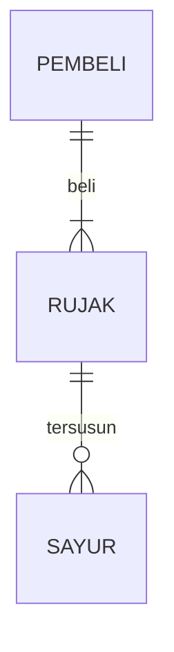

## 1.1 Latar Belakang
  Kemajuan teknologi informasi yang sangat cepat dan memasuki ke seluruh sektor dalam kehidupan sangat memungkinkan siapa saja dan apa saja yang sebelumnya tidak terbayangkan menjadi sebuah kenyataan. 
  Termasuk lingkungan pesantren, tempat lembaga pendidikan keagamaan yang masih eksis hingga saat ini, digitalisasi di dalam Pondok Pesantren menjadi salah satu tanda bahwa lembaga pesantren bukan lembaga pendidikan yang kurang menerima akan kemajuan dalam bidang teknologi informasi. 
  kali ini saya mengambil studi kasus dari pondok pesantren, yakni dengan membuat sistem layanan laundry digital dimana mempermudah pengasuh santri dalam melakukan pendataan, penjadwalan dan berbagai macam fitur yang dapat mempermudah pengasuh dalam pendataan santri sehari-hari khususnya dalam bidang jasa laundry pondok.
  ## 1.2 Deskripsi Teknologi Informasi
  lorem ipsum dolor sit amet paaarra bellum

  ## 1.3 Branding 
  Lorem Ipsum dolor sit amet parra bellum

  ## 2. User Story
  Sebagai | Keinginan | Dampak | Prioritas
---|---|---|---
Pengguna | Memesan Pesanan | Mendapatkan jasa layanan yang diingikan dalam memesan pesanan | ⭐⭐⭐⭐⭐
---|---|---|---
Pengguna | Memesan Pesanan | Mendapatkan jasa layanan yang diingikan dalam memesan pesanan | ⭐⭐⭐⭐⭐
---|---|---|---
Pengguna | Memesan Pesanan | Mendapatkan jasa layanan yang diingikan dalam memesan pesanan | ⭐⭐⭐⭐⭐
---|---|---|---
Pengguna | Memesan Pesanan | Mendapatkan jasa layanan yang diingikan dalam memesan pesanan | ⭐⭐⭐⭐⭐
---|---|---|---
Pengguna | Memesan Pesanan | Mendapatkan jasa layanan yang diingikan dalam memesan pesanan | ⭐⭐⭐⭐⭐
---|---|---|---
Pengguna | Memesan Pesanan | Mendapatkan jasa layanan yang diingikan dalam memesan pesanan | ⭐⭐⭐⭐⭐

## 3. Struktur Data

## 4. Arsitektur Sistem
## 5. Teknologi, Library, dan Framework
## 6. Desain User Experience dan User Interface
! [Contoh](https://www.figma.com/file/fyEcP3JXW92TcKZXS8RXFH/SB-Laundry?type=design&node-id=34%3A2&mode=design&t=DXPDnc2gQUsUxBnO-1)
