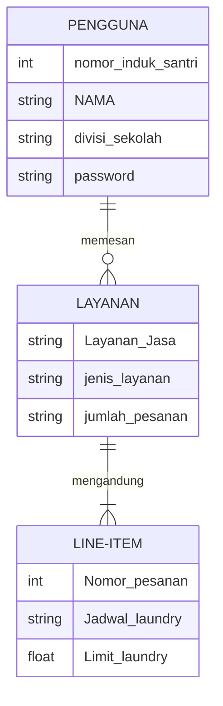
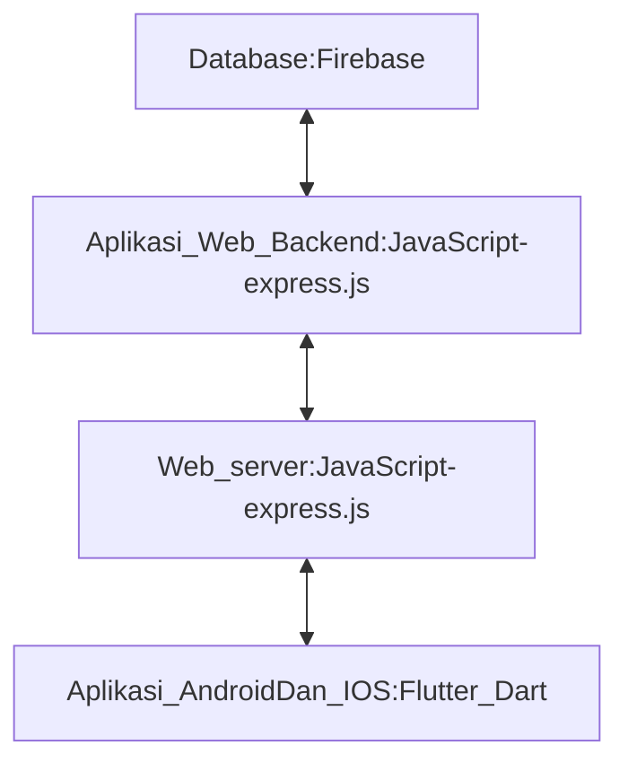

## MEMBUAT APLIKASI JASA LAUNDRY ( S B L )  
## 1.1 Latar Belakang
  Kemajuan teknologi informasi yang sangat cepat dan memasuki ke seluruh sektor dalam kehidupan sangat memungkinkan siapa saja dan apa saja yang sebelumnya tidak terbayangkan menjadi sebuah kenyataan. 
  Termasuk lingkungan pesantren, tempat lembaga pendidikan keagamaan yang masih eksis hingga saat ini, digitalisasi di dalam Pondok Pesantren menjadi salah satu tanda bahwa lembaga pesantren bukan lembaga pendidikan yang kurang menerima akan kemajuan dalam bidang teknologi informasi. 
  kali ini saya mengambil studi kasus dari pondok pesantren, yakni dengan membuat sistem layanan laundry digital dimana mempermudah  santri dalam melakukan pendataan, penjadwalan dan berbagai macam fitur yang dapat mempermudah  dalam  bidang jasa laundry pondok.  
  
  ## 1.2 Deskripsi Teknologi Informasi
Aplikasi Jasa LAundry ini diberi nama S B L, singkatan dari Sumur Bandung Laundry. Aplikasi yang bergerak di dalam jasa Laundry. Aplikasi ini dapat :  
1. Memesan Laundry dengan mudah dan simpel.  
2. Menerima Notifikasi Pengingat Jadwal Laundry  
3. Mengatur limit pemesanan Laundry dalam se bulan.   
  

  ## 1.3 Branding 
 Adapun Brand yang dirancang dalam sistem aplikasi laundry ini adalah :  

Merk: S B L  
Tagline: Laundry Mundah ! 
Campaign: Bagaimana membuat aplikasi yang memperrmudah sistem layanan Laundry di " Pondok Pesantren Pembangunan Sumur Bandung " 
Target user: 
Santri aktif "Pondok Pesantren Pembangunan Sumur Bandung". 
User experience theme: 
Sederhana,
Mudah 
Warna: Dominan Hijau, Sesuai dengan warna dominan Pondok  
Design :  

  ## 2. User Story
  Sebagai | Saya Ingin | Supaya Dapat | Prioritas
---|---|---|---
Pengguna | Memesan Pesanan | Mendapatkan jasa layanan yang diingikan dalam memesan pesanan | ⭐⭐⭐⭐⭐
| | |
Pengguna | Mendapat notifikasi pengingat | Dapat teringat jadwal Laundry User | ⭐⭐⭐⭐
| | |
Pengguna | Memesan sesuai kategori | Memesan Per kategori Laundry | ⭐⭐⭐⭐⭐
| | |
Pengguna | Melihat Jadwal dan Riwayat Laundry | Mengetahui jadwal Laundry ayng belum terlaksana, beserta riwayat Laundry yang sudah selesai | ⭐⭐⭐⭐

## 3. Struktur Data

## 4. Arsitektur Sistem

## 5. Teknologi, Library, dan Framework

## 6. Desain User Experience dan User Interface
! [Link](https://www.figma.com/proto/fyEcP3JXW92TcKZXS8RXFH/SB-Laundry?page-id=0%3A1&type=design&node-id=34-37&t=IFAAdm7krjaNnifP-1&scaling=scale-down&starting-point-node-id=0%3A3&mode=design)

## 7. Demonstrasi Video
## 8. Dalam video, jelaskan bagaimana mesin komputasi dan sistem operasi berperan dalam produk teknologi informasimu !
## 9. Dalam video, jelaskan bagaimana algoritma, struktur data, dan bahasa pemrograman berperan dalam produk teknologi informasimu !
## 10. Dalam video, jelaskan bagaimana metode pengembangan perangkat lunak / Software Development Life Cycle berperan dalam produk teknologi informasimu !
## 11. Dalam video, jelaskan bagaimana database / sistem basis data berperan dalam produk teknologi informasimu !

